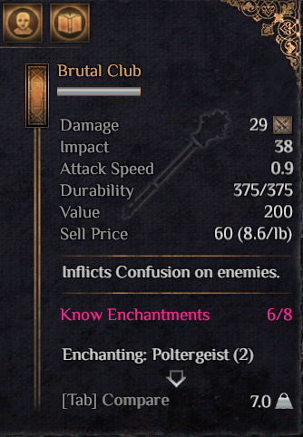
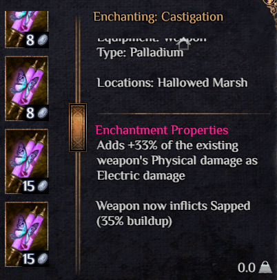

<h1 align="center">
    Outward Enchantments Viewer
</h1>
 

  
  

	
	

Outward mod that provides additional descriptions for items and enchantments.

## Why use this mod?

Do you find yourself constantly switching between **Outward** and the [Outward Wiki](https://outward.fandom.com/wiki/Outward_Wiki)? 
Tired of **alt-tabbing** and letting Chrome consume unnecessary system resources just to find information that should already be available in-game?  

The **Outward Enchantments Viewer Mod** has you covered!  

### Features:

1. **Detailed Enchantment Descriptions** – Enchantments now display both their bonuses and drawbacks.  
2. **Enchantment Availability Count** – Item descriptions indicate the total number of enchantments available for that item.  
3. **Inventory Compatibility Tracking** – Item descriptions show how many compatible enchantments exist in your inventory.  
4. **Enchantment Listing** – All enchantments that can be applied to the item are listed in the description.  
5. **Dynamic Enchantment Descriptions** – The system retrieves enchantment details from other mods, ensuring comprehensive and up-to-date descriptions.  
6. **Adaptive Item Descriptions** – Item descriptions dynamically update by gathering information from other mods about available enchantments.  
7. **Fixed Scroll View for Item Display Details** – Improves handling of longer modded descriptions by adjusting the scroll view, allowing for better readability and navigation. This enhances precision, provides more screen space, and ensures smooth scrolling, even when using a controller. 
8. **[Custom Enchantment Descriptions](#how-to-create-personalized-enchantment-descriptions)** – Allows players to define their own enchantment descriptions through XML, which are then loaded into the game for a personalized experience.  
9. **Configurable Display Settings** – Control how enchantment information is displayed through `BepInEx\config\gymmed.outwardenchantmentsviewer.cfg`. Customize the visibility of enchantment details using the following settings:  
   - **ShowEnchantmentDescriptions** – Enable or disable detailed enchantment descriptions.  
   - **ShowEquipmentDescriptions** – Toggle the display of enchantments on equipment.  
   - **ShowAllAvailableEnchantmentsCountForEquipment** – Choose whether to show the total number of enchantments available for each piece of equipment.  
   - **ShowMissingEnchantmentsForEquipment** – Decide if missing enchantments for equipment should be displayed.  
   - **ShowDescriptionsOnlyForInventory** – Restrict enchantment descriptions to items currently in the player’s inventory, hiding details for items in shops.  
   - **ShowDetailedOwnedEnchantments** – Enables detailed own enchantment descriptions for equipment.  
   - **ShowDetailedUnownedEnchantments** – Enables detailed not own enchantment descriptions for equipment. 

## How to use

1. Either clone/download the repository with Git or GitHub Desktop, or simply download the code manually.
2. Open `src/OutwardEnchantments.sln` with any C# IDE (Visual Studio, Rider, etc)
3. When you're ready, build the solution. It will be built to the `Release` folder (next to the `src` folder).
4. Take the DLL from the `Release` folder and put it in the `BepInEx/plugins/` folder. If you use r2modman, this can be found by going into r2modman settings and clicking on `Browse Profile Folder`.

## How to create personalized enchantment descriptions  

To add custom enchantment descriptions, follow these steps:  

1. Copy the example file [`customEnchantmentsDescriptions.xml.example`](./customEnchantmentsDescriptions.xml.example) and rename it to `customEnchantmentsDescriptions.xml`.  
2. Open the newly created file and add your custom enchantment descriptions by copying and modifying existing `<enchantment>` tags.  
3. You can find the IDs for vanilla enchantments in [`vanillaRecipesID.txt`](./vanillaRecipesID.txt).  
4. The `overwrite` attribute determines how your custom description interacts with existing ones:  
   - **`overwrite = true`** → Completely replaces the default enchantment description.  
   - **`overwrite = false`** → Adds your custom text as an addition to the existing description.  
5. To remove a custom description, simply delete the entire `<enchantment>` tag block from the XML file.  

This system allows for full customization, letting you personalize enchantment descriptions to fit your preferences.  

### If you liked the mod leave a star it's free
